# Cactus Identification: A Walkthrough from CNN to Transfer Learning with Pre-Trained Model VGG16

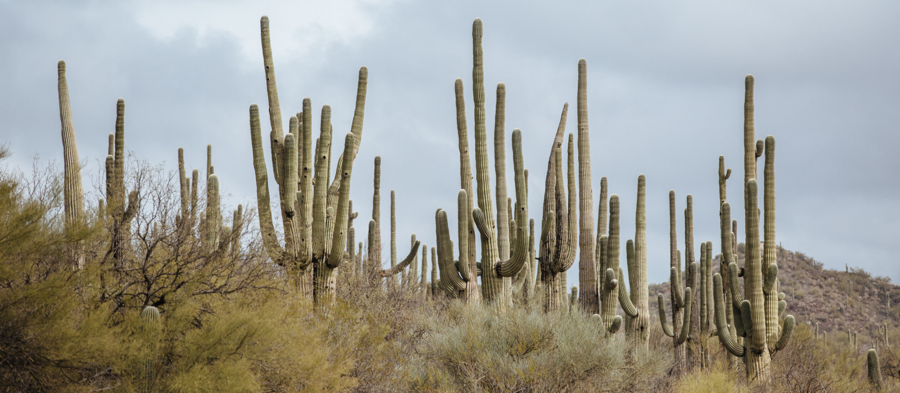

This project was my introduction to the world of Computer Vision using Deep Learning. In this write-up, I will do a walkthrough of the whole classifier making process, including:

* Data preprocessing

* Build a Convolutional Neural Network 

* Evaluate the model

* Make tweaks to improve performance: data augmentation, progressive resizing

* Apply transfer learning with a pre-trained model (VGG16)

* Test the model by making prediction on first 10 images from the test set

* Experiment with interactive testing using OpenCV

Full codes can be found [here](https://github.com/andreduong/aerial-cactus-identification/blob/master/aerial-cactus-identification.ipynb). [NBViewer Link](https://nbviewer.jupyter.org/github/andreduong/aerial-cactus-identification/blob/master/aerial-cactus-identification.ipynb).

# Data Description

[This dataset](https://www.kaggle.com/c/aerial-cactus-identification/data) contains a large number of 32 x 32 thumbnail images containing aerial photos of a columnar cactus (Neobuxbaumia tetetzo). The file name of an image corresponds to its id.

I will attempt to create a classifier capable of predicting whether an images contains a cactus.

# Data Overview

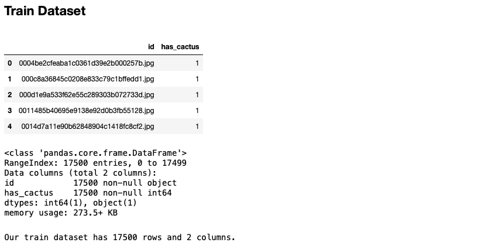

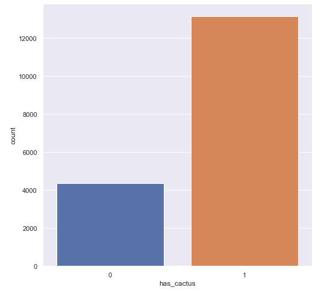

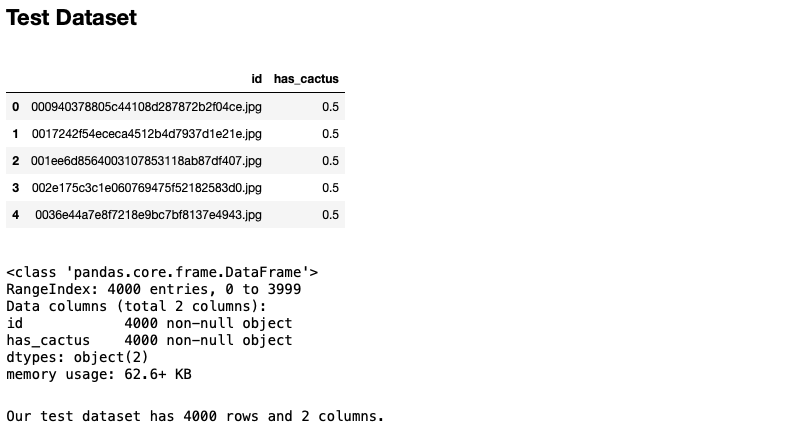

# Visualize Images

Let's take a look at a few sample images from the train set:

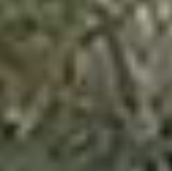

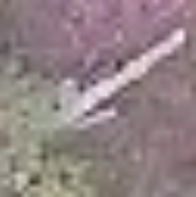

# Data Preprocessing

In this section, we create data generators for both train and test dataset. We rescale pixel values from [0, 255] to [0, 1], then perform data augmentation to all images. Full Python script for the data preprocessing process can be found [here](https://github.com/andreduong/aerial-cactus-identification/blob/master/preprocessing.py).

# Model Building

## Baseline Convolutional Neural Network Architecture

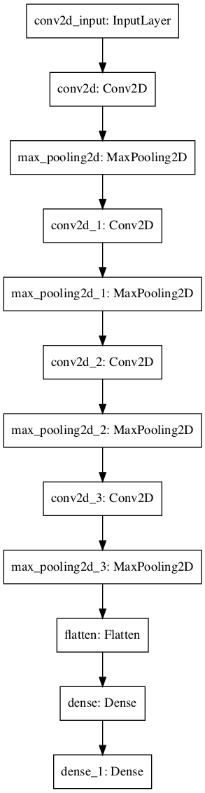

### Model Evaluation: Loss/Accuracy Graphs

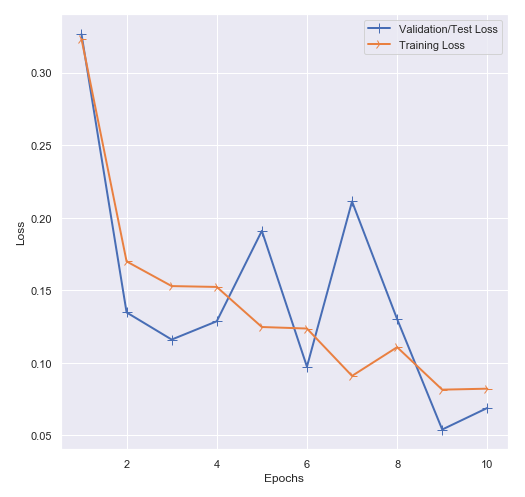

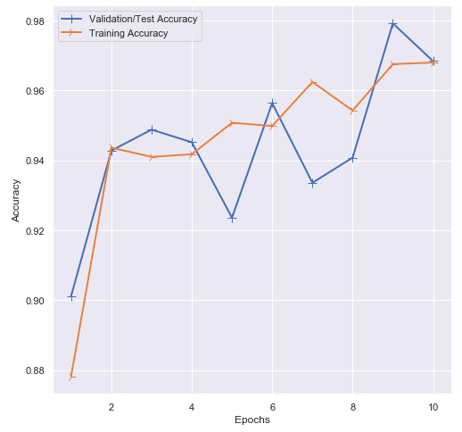

## Transfer Learning with Pre-Trained Model VGG16

In this section, we load the pre-trained model, freeze all layers except the top FC layers, then we add the top layers accordingly. Let's take a look at the model architecture after applying transfer learning:

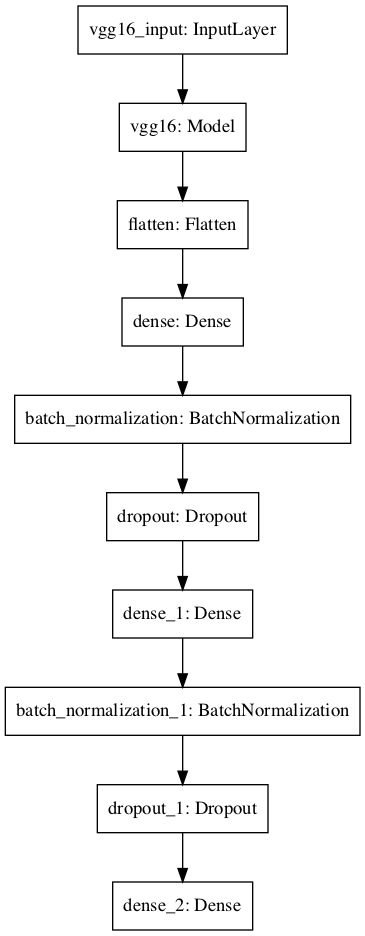

### Model Evaluation: Loss/Accuracy Graphs

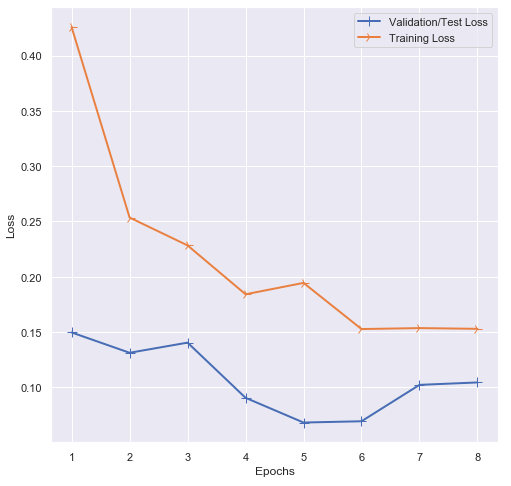

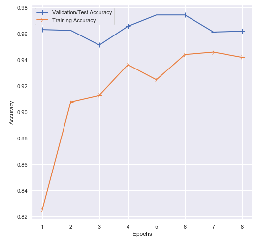

# Test Our Model

In this section, we write a Python script to test our model by making prediction on the first 10 images of the test set. Full Python script can be found [here](https://github.com/andreduong/aerial-cactus-identification/blob/master/model_testing.py).

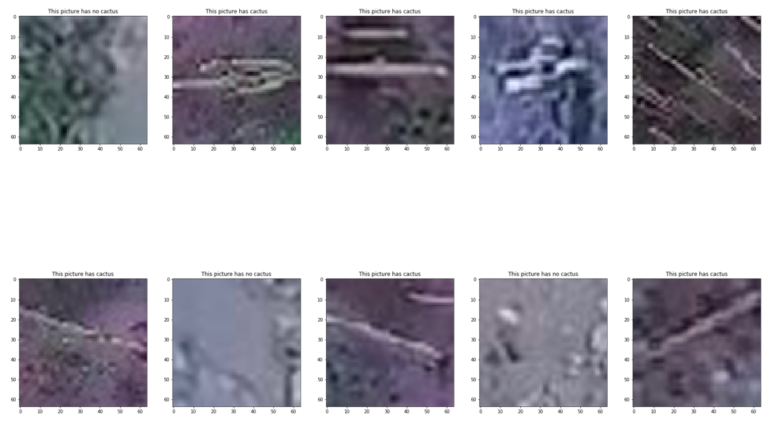

# Conclusion

In this project, I did a walkthrough of the whole classifier making process, including data preprocessing, building a Convolutional Neural Network, evaluating the model, making tweaks to improve performance: data augmentation, progressive resizing, applying transfer learning with a pre-trained model (VGG16), testing the model by making prediction on first 10 images from the test set, and experimenting with interactive testing using OpenCV. 

Computer Vision is a wildly developing field. Since the conclusion of this project, I have been focusing heavily on researching recent advances in convolutional neural network architectures, and hopefully I can apply what I've learned in more interesting projects like this in the future.
